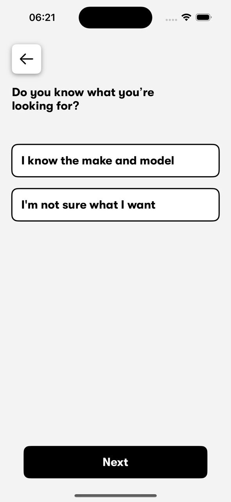

# Topic: Site for Car buying sugestions

### Summer FAF x Sigmoid Hackathon 2024
### Authors: Chichioi Iuliana, Istrati Daniel, Mândrescu Dragomir, Pascal Adrian, Plămaădeală Maxim

## Objectives:

Develop a tool that helps people of different ages and interests gather information about specific products, making complex information accessible and understandable, thus aiding them in making informed purchasing decisions.

## Tech Stack

Front - scss, typescript, react, swift
Back - python, postgresql
Design - figma

# Results

## Web app

After some brainstorming and loooong coding sessions we came to the idea to build a site and its IOS mobile equivalent for helping people find their desired car based on filter and preferences. 

### Landing Page

 
### Filters

We have a database with a variety of different cars that vary from brand, model, year of production ,transmission, type of fuel, state, bodytype, purpose and other. On the website the user selects some filters that are optional and then we send a request to the database with the required information. Then the database returns the car models that match the user preferences.

### Options

After the database returns the options, the website gets from the database the image of the model and also its specifications and displays the options to the user. A simple click on one of the options will redirect to the next page with more information about that specific vehicle.

### About Car

Here the user gets extended information about the car. He also has the option to compare it to a different vehicle if unsure about the decision.

### Compare

Same type of informtion about 2 different vehicles where the user can decide for himself what he prefers.

## Mobile App

### Landing Page

 
 
### Filters

 

### Options

 
 

Additionally we implemented a very innovative ✨bookmark✨ function.

### About Car

 

